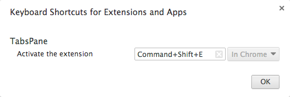

# TabsPane Chrome Extension

Implements Expose like functionality for Chrome. For screenshots see [TabsPane Chrome Store page](https://chrome.google.com/webstore/detail/tabspane/fopflmabgkkmpcbdcgogaoohldoelhpd?hl=en)

**Note:** Tabs screenshots are taken on tab activate event. They will appear after you use extension for a bit.

## Assign a Hotkey

1. Load [chrome://extensions/](chrome://extensions/)
2. Scroll to bottom of extensions page. On the bottom right click "Keyboard shortcuts" link
3. In the overlay window find TabsPane and set desired shortcut (for instance `Command+Shift+E`)

4. Use shortcut to open or activate TabsPane tab
